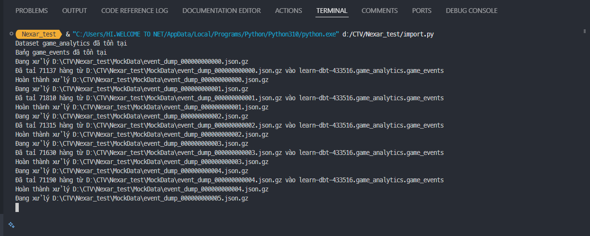
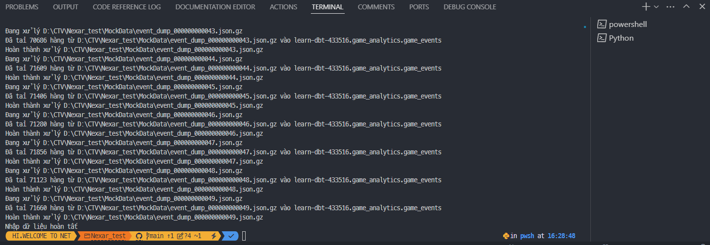
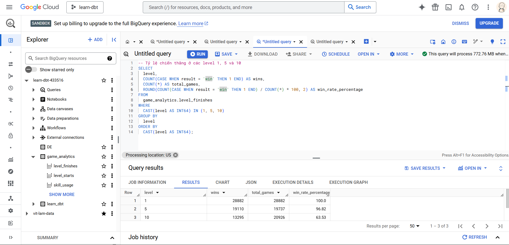
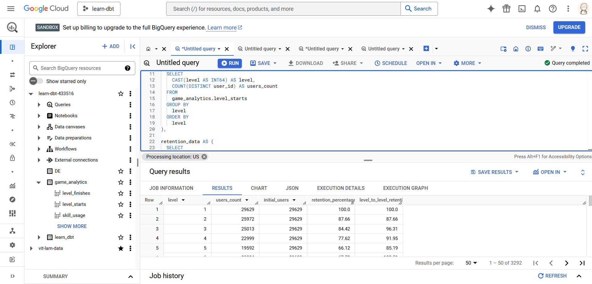

# nexar_test

## Câu 1: Phân biệt giữa Kimball, One Big Table và Relational Modeling. Đối với vai trò là Data Engineer, bạn sẽ lựa chọn phương pháp nào trong từng trường hợp cụ thể.

**Kimball**: phương pháp thiết kế data warehouse theo mô hình dimensional model với star schema hoặc snowflake schema

- Cấu trúc: bao gồm các bảng fact và dim

=> Chi tiết, dễ hiểu tối ưu cho truy vấn phân tích, phù hợp với báo cáo và BI. Dùng cho việc xây dựng data warehouse và tạo báo cáo BI

**One Big Table**: phương pháp đưa tất cả dữ liệu vào một bảng duy nhất thường sử dụng cho các bài toán machine learning

- Cấu trúc: 1 bảng lớn, phi chuẩn, nhiều cột

=> Đơn giản, hiệu quả cho việc huấn luyện mô hình nhưng khó bảo trì và có thể gây dư thừa. Thường cho việc chuẩn bị dữ liệu huấn luyện mô hình học máy, học sâu.

**Relational modeling**: mô hình thiết kế dữ liệu truyền thống tuân theo các nguyên tắc của RDBMS và chuẩn hóa

- Cấu trúc: nhiều bảng liên kết với nhau thông qua khóa và tối ưu thành các chuẩn 3NF...

=> Giảm thiểu dữ thừa, tăng tính toàn vẹn phù hợp với OLTP. Nhưng truy vấn phức tạp, cần join nhiều. Hợp khi xây dựng hệ thống OLTP tối ưu, thiết kế db cho hệ thống dịch vụ

## Câu 2: Trong Bigquery, tại sao chỉ partition được column dạng INTEGER, time-unit, ingestion time? 

- Hiệu năng I/O và xử lý phân tán: Khi BigQuery xử lý hàng nghìn node song song, các partition dựa trên giá trị số hoặc thời gian cho phép phân chia khối lượng công việc hiệu quả hơn. Hệ thống biết chính xác ranh giới của mỗi partition và có thể prune data không cần thiết.

- Hiệu quả lưu trữ Colossus: BigQuery sử dụng hệ thống lưu trữ Colossus, và cách tổ chức dữ liệu theo partitioning kiểu này tối ưu cho việc tìm kiếm và thu thập dữ liệu từ storage layer.

- Nguyên tắc cardinality: Với kinh nghiệm xây dựng data warehouse, chúng ta biết rằng cột partition lý tưởng nên có cardinality vừa phải - không quá cao (như UUID), không quá thấp (như Boolean). INTEGER và DATE/TIMESTAMP có đặc tính này.

- Cost management: Qua thực tế làm việc, partitioning theo thời gian cho phép kiểm soát chi phí hiệu quả nhất. Ví dụ, tôi thường setup expiration policy trên các partition theo date để tự động xóa dữ liệu cũ sau 90 ngày, tiết kiệm chi phí lưu trữ đáng kể.

- Trải nghiệm query thực tế: Khi filter theo partition key trong query, BigQuery chỉ scan đúng những partition cần thiết. Trong dự án thực tế, tôi từng giảm được 95% scan data và tiết kiệm rất nhiều chi phí khi cấu trúc partition hợp lý.

Từ kinh nghiệm thực tế, STRING hoặc các kiểu dữ liệu khác thường gây ra skewed partitions - một số partition quá lớn, số khác quá nhỏ - làm giảm hiệu quả phân tán xử lý và khiến các truy vấn chậm hơn.

## Câu 3: Trong Bigquery, mô tả nguyên lý hoạt động (ở cấp độ engine) của clustered table, trong trường hợp sử dụng column dạng STRING. 


Nguyên lý hoạt động của clustered table trong BigQuery khi sử dụng cột STRING:

1. Quá trình phân cụm (clustering): Khi dữ liệu được tải vào bảng đã được cấu hình clustering trên cột STRING, BigQuery sẽ sắp xếp dữ liệu dựa trên giá trị của cột đó. Đối với cột STRING, BigQuery sẽ sắp xếp theo thứ tự từ điển (lexicographical order).
2. Lưu trữ dữ liệu theo blocks: Sau khi dữ liệu được sắp xếp, BigQuery sẽ lưu trữ chúng thành các blocks liên tiếp. Mỗi block chứa dữ liệu có giá trị clustering columns tương tự nhau. Đối với STRING, các giá trị văn bản gần nhau về mặt từ điển sẽ được lưu trữ gần nhau.
3. Tạo metadata: BigQuery tạo và duy trì metadata về phạm vi giá trị trong mỗi block dữ liệu. Đối với cột STRING, metadata sẽ lưu thông tin về khoảng giá trị chuỗi có trong mỗi block.
4. Cơ chế pruning khi truy vấn: Khi thực hiện truy vấn có điều kiện lọc trên cột clustering STRING, BigQuery engine sẽ:

- Đọc metadata để xác định các blocks có thể chứa dữ liệu phù hợp
- Bỏ qua (prune) các blocks không chứa giá trị STRING phù hợp với điều kiện truy vấn
- Chỉ quét (scan) các blocks tiềm năng, giảm đáng kể lượng dữ liệu cần đọc

5. Áp dụng heuristics cho STRING: Đối với cột STRING, BigQuery sử dụng các thuật toán đặc biệt để xác định hiệu quả việc phân cụm. Vì STRING có thể có độ dài thay đổi và tập giá trị lớn, BigQuery có thể sử dụng kỹ thuật hashing hoặc prefix-based clustering để tối ưu hóa việc lưu trữ và truy vấn.
6. Automatic re-clustering: Khi dữ liệu mới được thêm vào bảng, BigQuery sẽ tự động sắp xếp dữ liệu mới trong các blocks của nó, nhưng không sắp xếp lại toàn bộ bảng. Theo thời gian, BigQuery thực hiện các hoạt động background để duy trì hiệu quả của clustering.
7. Giới hạn cho STRING: Vì STRING có thể chứa giá trị với kích thước lớn và không đồng đều, BigQuery có thể áp dụng giới hạn về số lượng cột STRING trong clustering key (tối đa 4 cột clustering) và tối ưu hóa hiệu suất dựa trên đặc điểm phân phối dữ liệu.

Ưu điểm chính khi sử dụng clustering với cột STRING là khả năng lọc hiệu quả các truy vấn tìm kiếm theo chuỗi cụ thể, giúp giảm chi phí và cải thiện hiệu suất truy vấn đáng kể.


## Câu 4: Trong Bigquery, so sánh hàm APPROX_COUNT_DISTINCT và COUNT DISTINCT. 
**COUNT DISTINCT:** Tính chính xác số lượng giá trị duy nhất, yêu cầu BigQuery phải lưu trữ và theo dõi mọi giá trị duy nhất trong bộ nhớ.

**APPROX_COUNT_DISTINCT:** Sử dụng thuật toán HyperLogLog++ để ước tính số lượng giá trị duy nhất. Thay vì lưu trữ toàn bộ giá trị, nó chỉ lưu trữ "sketches" của dữ liệu.

**Hiệu năng và tài nguyên**

**COUNT DISTINCT:**

- Tốn nhiều bộ nhớ vì phải theo dõi mọi giá trị duy nhất
- Yêu cầu shuffle data nhiều hơn giữa các nodes
- Tốc độ chậm hơn với large datasets
- Chi phí xử lý cao hơn do scan và xử lý toàn bộ dữ liệu

**APPROX_COUNT_DISTINCT:**

- Sử dụng bộ nhớ cố định, không phụ thuộc vào lượng dữ liệu
- Giảm đáng kể lượng data phải shuffle
- Tốc độ nhanh hơn đáng kể (có thể nhanh hơn 10-100x)
- Chi phí xử lý thấp hơn

**Độ chính xác:**

- COUNT DISTINCT: Kết quả chính xác 100%
- APPROX_COUNT_DISTINCT: Độ lỗi tiêu chuẩn khoảng 1%, nghĩa là kết quả thường nằm trong khoảng ±2% của giá trị thực

**Trường hợp sử dụng phù hợp**

COUNT DISTINCT phù hợp khi:

- Cần độ chính xác tuyệt đối
- Làm việc với dataset nhỏ
- Sử dụng trong báo cáo tài chính hoặc các trường hợp đòi hỏi tính chính xác cao


APPROX_COUNT_DISTINCT phù hợp khi:

- Chấp nhận sai số nhỏ để đổi lấy hiệu suất
- Làm việc với dataset lớn
- Sử dụng trong analytics, dashboards, monitoring
- Trong các trường hợp cần optimize chi phí


## Câu 5: Ứng viên được cung cấp một loạt các file dữ liệu ở dạng JSON-ND đã được nén lại ở 
chuẩn GZIP MockData Dữ liệu chứa các event thu thập được từ 1 game mobile. Ứng viên thực hiện các yêu cầu sau: 

### a. Import dữ liệu vào BigQuery với schema hợp lý. 

Thực hiện import dữ liệu vào BigQuery bằng code python (code có trong file import.py). Lần lượt thực hiện các bước xử lý




- Khởi tạo kết nối tới BigQuery với IAM
- Định nghĩa dataset và table_id
- Tạo bảng từ định dạng bảng schema.json
- Giải nén các file .json.zip vào bộ nhớ tạm, đẩy vào BigQuery
- Xóa file tạm sau khi hoàn tất.
- Xử lý file dữ liệu: Duyệt thư mục, tìm file event_dump_*.json.gz, xử lý và tải lên BigQuery.


### b. Viết lệnh truy vấn cho các câu hỏi sau: - 

Tỷ lệ chiến thắng (win) ở các level 1,5,10 của toàn bộ user?
```sql
SELECT
  level,
  COUNT(CASE WHEN result = 'win' THEN 1 END) AS wins,
  COUNT(*) AS total_games,
  ROUND(COUNT(CASE WHEN result = 'win' THEN 1 END) / COUNT(*) * 100, 2) AS win_rate_percentage
FROM
  game_analytics.level_finishes
WHERE
  CAST(level AS INT64) IN (1, 5, 10)
GROUP BY
  level
ORDER BY
  CAST(level AS INT64);
```

Result:



Chú ý: 

- Tỷ lệ sử dụng skill trung bình trong 1 ván chơi của những user ở Brazil? 

```sql
WITH 
brazil_games AS (
  -- Lấy tất cả các ván chơi của người dùng Brazil
  SELECT
    user_id,
    level,
    event_date,
    event_timestamp
  FROM
    game_analytics.level_finishes
  WHERE
    geo.country = 'Brazil'
),

brazil_skill_usage AS (
  -- Đếm số skill được sử dụng trong mỗi ván chơi của người dùng Brazil
  SELECT
    bg.user_id,
    bg.level,
    bg.event_date,
    COUNT(su.skill_name) AS skills_used
  FROM
    brazil_games bg
  LEFT JOIN
    game_analytics.skill_usage su
  ON
    bg.user_id = su.user_id AND
    bg.level = su.level AND
    bg.event_date = su.event_date
  GROUP BY
    bg.user_id,
    bg.level,
    bg.event_date
)

-- Tính trung bình
SELECT
  AVG(skills_used) AS avg_skills_per_game
FROM
  brazil_skill_usage;
```
Result: 0.45072828096


- Tỷ lệ user còn ở lại chơi game qua từng level? (note: giả sử rằng số lượng user chơi các level sau sẽ ít hơn level trước, vì vậy câu hỏi yêu cầu kết quả chính xác rằng sau mỗi level, số user còn lại là bao nhiêu). 

```sql
-- Tỷ lệ người dùng còn ở lại chơi game qua từng level
WITH 
all_users AS (
  -- Lấy số lượng người dùng riêng biệt đã bắt đầu ít nhất một ván chơi
  SELECT COUNT(DISTINCT user_id) AS total_users
  FROM game_analytics.level_starts
),

users_by_level AS (
  -- Lấy số lượng người dùng riêng biệt cho mỗi level
  SELECT
    CAST(level AS INT64) AS level,
    COUNT(DISTINCT user_id) AS users_count
  FROM
    game_analytics.level_starts
  GROUP BY
    level
  ORDER BY
    level
),

retention_data AS (
  SELECT
    ubl.level,
    ubl.users_count,
    FIRST_VALUE(ubl.users_count) OVER(ORDER BY ubl.level) AS initial_users,
    LAG(ubl.users_count, 1) OVER(ORDER BY ubl.level) AS previous_level_users
  FROM
    users_by_level ubl
)

-- Tính tỷ lệ giữ chân người dùng
SELECT
  level,
  users_count,
  initial_users,
  ROUND(users_count / initial_users * 100, 2) AS retention_percentage,
  CASE
    WHEN previous_level_users IS NULL THEN 100
    ELSE ROUND(users_count / previous_level_users * 100, 2)
  END AS level_to_level_retention_percentage
FROM
  retention_data
ORDER BY
  level;
```

Result:



Giải nghĩa các thông tin: 
- event_date: ngày event được log. 
- event_timestamp: thời điểm cụ thể của event được log. 
- event_name: tên của event. 
- event_params: các cặp key-value biểu thị dữ liệu của event. 
- geo: chứa thông tin về địa lý. 

Các event tiêu biểu: 

- level_start: được log lúc user bắt đầu chơi 1 level, với các params sau: 

+  level: level của ván chơi. 

- level_finish: được log lúc user kết lúc 1 level, với các params sau: 

+  level: level hiện tại. 

+ duration: thời gian đã chơi, tính bằng giây. 

+ result: kết quả ván chơi. 

- use_skill: được log lúc user sử dụng 1 skill, với các params sau: 

+ level: level hiện tại. 

+ name: tên của skill.


